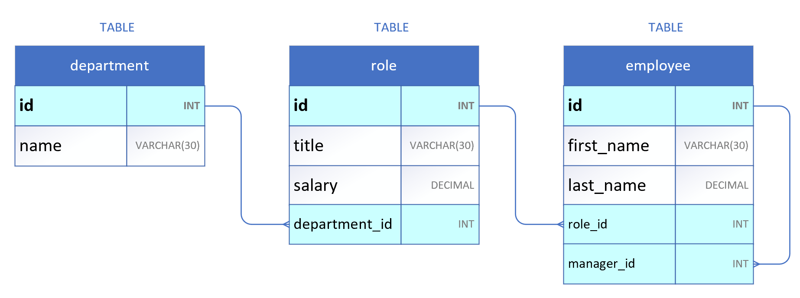
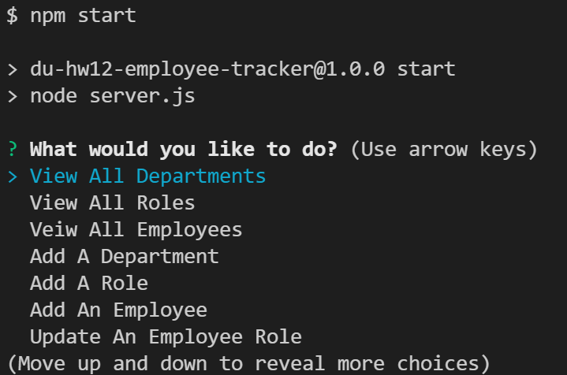

# DU-HW12-Employee-Tracker

DU Coding Bootcamp Homework 12: SQL Employee Tracker

# node.js application with SQL connectivity
This is a node.js script relying on NPM package **inquirer** that accesses a SQL server as defined by the connection in the server.js file.

Github Repository Address: <https://github.com/GittinIt6/DU-HW12-Employee-Tracker>

See walkthrough/demonstration video at <https://youtu.be/l9fSH9553IE>

## Purpose

This application is specific to anyone that wants to view and populate team organization (roles, salary, department, and employee).

## Instructions
1. Ensure you have downloaded and installed node.js and have rebooted your system (if Windows)
2. Clone repository to your system.
3. From a terminal, ensure you are in the server.js directory
4. Update the server.js const db = mysql.createConnection location to include your database connection info.
5. Within a mysql CLI, run the ./db/schema.sql and then the ./db/seeds.sql to create and populate the database.
6. Run:
~~~
npm i
npm start
~~~

## Audience

The intended audience is an individual that would like to manage a company employee database.

&#x2611; **Technical Knowledge:**
The user of this site does need to have a technical background, and *should* understand node.js and MYSQL capabilities.

## Technical Detail

This application uses node.js with **MYSQL**, **inquire**, and **console.table**.

The files are configured as follows:
```
Root Directory/
|
│ --server.js
│ --package.json
│ --.gitignore
│ --readme.md
|
└───db/ (folder)
   ├── schema.sql
   └── seeds.sql
```
>**node.js**: This site uses node.js <https://nodejs.org/>

>**MySQL**: This site uses MYSQL

>**inquirer NPM package**: This site uses inquirer <https://www.npmjs.com/package/inquirer>

>**console.log**: This site uses console.table <https://developer.mozilla.org/en-US/docs/Web/API/console/table>

### SQL Schema:



### Screenshot:



## Revision History 

1. This application was created in March 2022 as part of a bootcamp assignment. It was created from scratch with requirements given by the instructor.